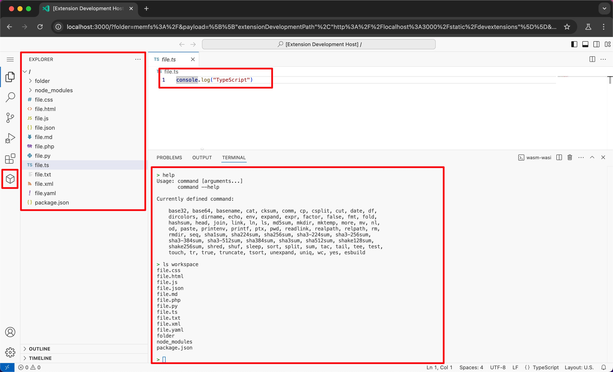

# AeroIDE

Yet Another IDE: 基于浏览器的在线代码编辑器

## Features

- [x] 虚拟工作区
  - [x] 浏览器内虚拟文件系统
  - [x] 虚拟文件系统持久化
  - [x] 支持 ZIP 导入导出
  - [x] 支持文件搜索功能
  - [x] 支持文字搜索功能
- [x] 虚拟终端
  - [x] WASM WASI 支持
  - [x] 访问虚拟工作区文件系统
  - [x] 对接 coreutils
  - [x] 对接 esbuild
  - [x] 实现 Ctrl+C 终端命令能力
  - [x] 实现 Ctrl+L/clear 清屏能力
  - [x] 实现命令行历史记录能力
- [ ] JS 在线开发调试
  - [ ] 支持 NPM 包
  - [ ] 实现 JS 在线打包逻辑
  - [ ] 实现 JS 在线运行/调试逻辑

## Contributing

详见 [CONTRIBUTING.md](./CONTRIBUTING.md)

## License

此项目遵循 [MIT 开源协议](./LICENSE)

## Thanks

本项目的实现离不开以下项目的启发：

- [https://github.com/Idered/iridium](https://github.com/Idered/iridium)
- [https://github.com/eamodio/vscode-remotehub](https://github.com/eamodio/vscode-remotehub)
- [https://github.com/SchoofsKelvin/vscode-sshfs](https://github.com/SchoofsKelvin/vscode-sshfs)
- [https://github.com/microsoft/vscode-anycode](https://github.com/microsoft/vscode-anycode)
- [https://github.com/codesandbox/codesandbox-client/tree/master/packages/sandpack-core](https://github.com/codesandbox/codesandbox-client/tree/master/packages/sandpack-core)
